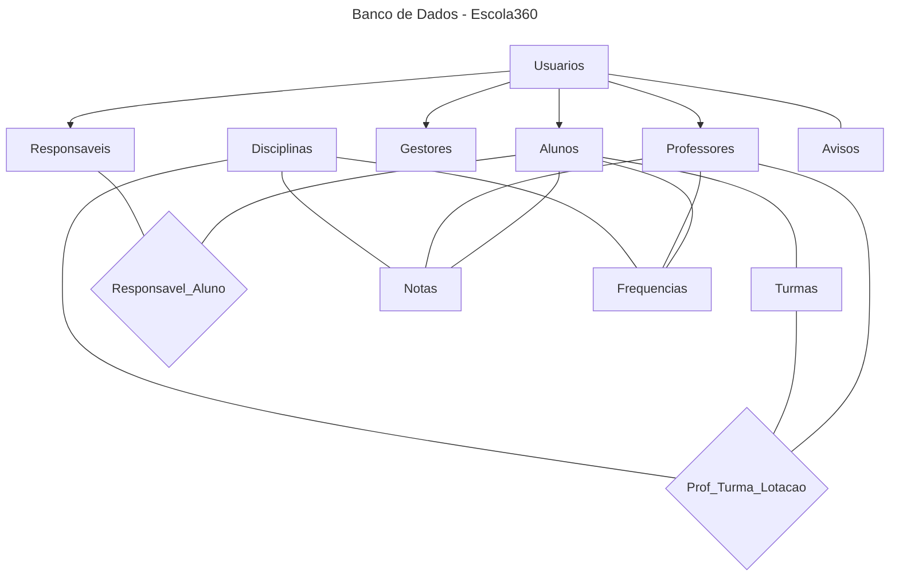

# 📘Escola360 - Dashboard de Acompanhamento Escolar

O Sistema Escola 360 é uma aplicação de gestão escolar que modela o ecossistema de uma instituição de ensino. Desenvolvido com foco em boas práticas de programação, extensibilidade e manutenibilidade, o sistema busca oferecer uma base sólida para o gerenciamento acadêmico.

------------------------------------------------------------------------
## 📂 Características principais:

 - Gestão de múltiplos tipos de usuários (professores, alunos, responsáveis, gestores)

 - Controle completo de notas e frequência

 - Sistema de disciplinas curriculares

 - Geração de relatórios

 - Arquitetura modular e extensível

**OBS -*** <ins>Sistema na fase inicial de desenvolvimento.</ins>
Nesta etapa foi implementado apenas o básico do Backend do sistema.

------------------------------------------------------------------------
## 🧩 Visão Geral do Projeto

O projeto está organizado em módulos, cada um representando uma parte do domínio:

 👤 **usuarios.py:**
  + Classes base (Usuario, Autenticavel, GeradorRelatorio) e papéis de gestão, ensino e acompanhamento  (Professor, Gestor, Responsavel).

 👨**aluno.py**
  + Implementação da classe Aluno e seus métodos de consulta de dados acadêmicos.

 📚**disciplinas.py**
  + Implementação da classe Disciplina e seu registro de notas/frequências.

 📝**avaliacao.py**
  + Classes que representam registros acadêmicos (Nota e Frequencia).

📊**relatorios.py**
  + Classe simples para o objeto Relatorio, usado pelo Gestor.

⚙️**main.py**
  + Script de demonstração para testar as funcionalidades e relações entre as classes.


------------------------------------------------------------------------
## ▶️Como Executar

Certifique-se de ter o Python 3.10+ instalado.

Garanta que todos os arquivos estejam na mesma pasta:

    usuarios.py

    aluno.py

    disciplinas.py

    avaliacao.py

    relatorios.py

    main.py

No terminal, navegue até a pasta do projeto e execute:
```python
python main.py
```


Você deverá ver uma saída semelhante a:
````
--- 1. CRIAÇÃO DE ENTIDADES ---
Professor criado: João Silva (ID: 10)
----------------------------------------
--- 2. TESTES DE AUTENTICAÇÃO ---
Login de João Silva: SUCESSO.
Login de João Silva: FALHA (esperado).
----------------------------------------
--- 3. LANÇAMENTO DE NOTAS E VALIDAÇÃO ---
Nota 9.0 em Matemática lançada com sucesso.
Nota 7.5 em Português lançada com sucesso.
Teste de Erro de Nota: SUCESSO. Erro capturado: valor da nota deve estar entre 0 e 10
----------------------------------------
--- 4. TESTES DE FREQUÊNCIA E CÁLCULOS ---
Total de Aulas de Matemática: 5
Presenças: 3 | Faltas: 2
Porcentagem de Frequência: 60.00%
----------------------------------------
--- 5. TESTES DE RELACIONAMENTO ---
Notas registradas para Ana Pereira:
  > Matemática: 9.0 (Prova Mensal)
  > Português: 7.5 (Trabalho)
Notas registradas em Matemática:
  > Aluno: Ana Pereira, Nota: 9.0
````
(Os textos exatos podem variar ligeiramente conforme adaptações/alterações no arquivo main.py.)

------------------------------------------------------------------------
## ✅ Conceitos de design e boas práticas utilizadas
Este projeto foi pensado como um modelo de domínio didático, aplicando boas práticas de Programação Orientada a Objetos (POO):

> Herança e polimorfismo

Usuario é a classe base abstrata, enquanto Gestor, Professor, Responsavel e Aluno especializam seu comportamento.

Interfaces (Autenticavel, GeradorRelatorio) definem contratos claros.

> Encapsulamento

Atributos privados (__nome, __notas, __frequencias etc.) e properties expõem apenas o que é necessário.

As coleções são retornadas como cópias, evitando modificação externa direta.

> Validação de regras de negócio

Notas limitadas entre 0 e 10.

Status de frequência limitado a “P” ou “F”.

E-mail com formato mínimo.

ID positivo, CPF não vazio.

> Consistência do modelo

Quando o professor lança uma nota ou registra uma frequência, o código atualiza as listas do Professor, do Aluno e da Disciplina, garantindo que todos os lados do relacionamento se mantenham sincronizados.

------------------------------------------------------------------------
## 🚀 Possíveis usos do Escola360
Embora o projeto seja pequeno e construido para fins didáticos, ele já representa um núcleo que poderia facilmente ser expandido em várias direções. Vejamos algumas possibilidades:

1. Backend de um sistema escolar web ou mobile
   - Servir como camada de domínio em uma API (Flask, FastAPI ou Django), expondo endpoints para:
     - Cadastro de usuários, alunos, disciplinas.
     -	Lançamento de notas e registro de frequência.
     -	Geração de relatórios consolidados para gestores, professores, etc..
       
2. Ferramenta de acompanhamento pedagógico
   - Professores/Gestores poderiam usar uma aplicação simples, baseada nesse modelo, para:
     - Registrar avaliações e presenças em tempo real.
     - Gerar relatórios por aluno, por turma ou por disciplina.
     - Exportar dados em CSV/JSON para outros sistemas.
       
3. Criação de Portal de Pais e Alunos
   - Essa estrutura pode ser facilmente convertida em uma API para alimentar um portal onde responsáveis e alunos acessam suas informações em tempo real, como:
     - Notificações de Ocorrências.
     - Agendamento de Reuniões.
     - Visualização/acompanhamento de atividades escolares.
       
4. Protótipo para integração com ERPs escolares
  - O modelo poderia ser integrado a sistemas maiores, atuando como:
    - Módulo de “vida acadêmica” (notas, frequências, boletins).
    - Fonte de dados para dashboards de desempenho e evasão.
------------------------------------------------------------------------
## 🗄️ Banco de dados utilizado no Escola360

O projeto fisico do banco de dados do Escola360 foi desenvolvido utilizando o Sistema Gerenciador de Banco de Dados (SGBD) PostgreSQL, escolhido por oferecer suporte robusto a integridade referencial, constraints avançadas, validações semânticas e conformidade com padrões SQL. 

🙋 **Mas o que é exatamente o projeto físico de um banco de dados?**

O **projeto físico** é a etapa final da modelagem de dados. É onde os diagramas e conceitos abstratos são transformados em código SQL. Nessa fase, definimos como os dados serão armazenados, criando as tabelas, escolhendo os tipos de dados, definindo chaves primárias e estrangeiras, índices e regras de validação (constraints). Ou seja, é quando o banco sai do papel e passa a existir de fato dentro de um SGBD (como o PostgreSQL, no nosso caso).
**Dominar essa etapa é fundamental, principalmente para quem está aprendento a programar**. Um projeto físico bem feito é essencial para qualquer aplicação seria. Entender a lógica por trás da criação das tabelas, dos relacionamentos, das chaves, ajuda o estutande a desenvolver sistemas mais robustos, organizados e profissionais. Além disso, quando o banco de dados é mal implementado o código do programa (front-end e back-end) fica mais complexo, lento e cheio de "gambiarras" para compensar as falhas na estrutura de dados.
O diagrama abaixo é uma representação simplificada no banco de dados criado para o Escola360. O código sql e o diagrama lógico estão nos arquivos do projeto.


## 🎨 Prototipação da Interface (Wireframe)

Antes do desenvolvimento completo do frontend de qualquer projeto, é uma prática recomendada realizar a prototipação da interface utilizando wirerames. Um wireframe é uma representação visual simplificada da interface de um sistema, utilizada para planejar a organização dos elementos da tela, a navegação entre páginas e a experiência do usuário (UX), sem focar inicialmente em cores, tipografia ou design visual final. No projeto **Escola360**, o processo de criação do wireframe seguiu uma abordagem baseada em **Design Centrado no Usuário (DCU)**, priorizando as necessidades reais dos diferentes perfis que utilizam a plataforma.

A criação de um wireframe geralmente segue algumas etapas fundamentais:

---

## 1️⃣ Identificação dos Usuários do Sistema

O primeiro passo para a prototipagem é definir **quem interage com o sistema** e quais são suas necessidades.

No **Escola360**, foram identificados quatro perfis distintos de usuários, cada um com demandas específicas:

- **Gestor**  
  Necessita de uma visão **macroscópica da instituição**, com acesso a indicadores gerais e ferramentas administrativas.

- **Professor**  
  Possui foco em **operações acadêmicas rápidas**, como lançamento de notas e registro de frequência.

- **Aluno**  
  Utiliza o sistema principalmente para **consulta de informações acadêmicas**, como boletim, calendário e avisos.

- **Responsável**  
  Necessita acompanhar o desempenho do aluno, realizando **consulta a boletins, frequência e comunicados da escola**.

A identificação desses perfis é essencial para orientar as decisões de design da interface.

---

## 2️⃣ Definição das Funcionalidades Principais

Após identificar os usuários, é necessário listar as **funcionalidades do sistema**.  
Essas funcionalidades são utilizadas para construir a estrutura das páginas e a navegação da aplicação.

No projeto **Escola360**, as principais funcionalidades incluem:

- Login e autenticação de usuários
- Gerenciamento de turmas, disciplinas e usuários
- Dashboard com indicadores acadêmicos
- Lançamento de notas
- Registro de frequência
- Consulta de boletim escolar (notas e frequências)
- Comunicação escolar (avisos)
- Geração de relatórios

---

## 3️⃣ Definição da Estrutura de Navegação

Antes de iniciar o desenho das telas, é importante definir **como o usuário navegará pelo sistema**.

Essa estrutura é representada por um **Sitemap**, que demonstra a hierarquia de páginas e a relação entre elas. Essa etapa é essencial para garantir:

- organização da informação
- clareza de navegação
- escalabilidade do sistema

### Exemplo simplificado da navegação no Escola360

```bash
Login
 ├── Dashboard Gestor
 │    ├── Gerenciar Usuários
 │    ├── Gerenciar Turmas
 │    ├── Gerenciar Disciplinas
 │    └── Relatórios
 │
 ├── Dashboard Professor
 │    ├── Minhas Turmas
 │    ├── Lançar Notas
 │    ├── Lançar Frequência
 │    └── Comunicação Escolar
 │
 ├── Dashboard Aluno
 │    ├── Boletim Escolar
 │    ├── Calendário de Aulas
 │    └── Mural de Avisos
 │
 └── Dashboard Responsável
      ├── Boletim e Frequência
      ├── Calendário de Aulas
      └── Mural de Avisos

```
---

## 4️⃣ Estruturação da Interface (Desenho das Telas - Wireframe)

Nesta etapa o foco está na **organização dos elementos na tela**, sem preocupação inicial com cores, tipografia ou design visual final.

O wireframe utiliza **caixas, linhas e blocos estruturais** para representar os componentes da interface.

Em geral, um wireframe deve apresentar:

- Estrutura geral da página
- Menus de navegação
- Botões principais
- Campos de formulário
- Listas e tabelas
- Indicadores e dashboards

No **Escola360**, algumas decisões de design incluem:

- **Dashboards com indicadores rápidos**
- **Menu lateral fixo** para navegação entre módulos
- **Tabelas estruturadas** para lançamento de notas e registro de presença
- **Mural de avisos** para comunicação entre escola, alunos e responsáveis

Essas decisões ajudam a tornar o sistema **mais organizado, intuitivo e eficiente para os usuários**.

---

## 🛠️ Ferramentas Recomendadas

Diversas ferramentas podem ser utilizadas para criar wireframes e protótipos de interface. Algumas das mais utilizadas são:

- **Figma**
- **Adobe XD**
- **Balsamiq**
- **Draw.io**
- **Canva**
- **Miro**

No wireframe do **Escola360**, foi utilizado o **Canva** devido à familiaridade da equipe com a ferramenta.

🔗 https://www.canva.com/pt_br/

---

## ✅ Validação do Wireframe

Após a criação do wireframe, é importante realizar sua **validação com usuários ou stakeholders**.

Nesta etapa são avaliados aspectos como:

- Se a experiência de uso atende às necessidades dos usuários
- Se os rótulos dos menus são compreensíveis
- Se a navegação entre telas é intuitiva
- Se as funcionalidades estão organizadas de forma clara

Realizar validação ainda na fase de **wireframe** permite identificar problemas antes do desenvolvimento do sistema, reduzindo custos e retrabalho da equipe.

---

# 👥 Benefícios do Design Centrado no Usuário (DCU)

O **Design Centrado no Usuário (DCU)** é uma metodologia de desenvolvimento que coloca o usuário final no centro das decisões de design. Isso significa que as interfaces, fluxos de navegação e funcionalidades são projetadas considerando:

- necessidades dos usuários
- limitações tecnológicas
- expectativas de uso
- comportamentos reais das pessoas

Na prototipação do **Escola360**, a adoção do DCU não se restringiu apenas à estética visual, mas atuou como um **pilar fundamental do projeto**.

A aplicação desses princípios contribui diretamente para a melhoria da qualidade dos sistemas, especialmente em aspectos como:

- **Redução de erros humanos**
- **Melhoria da usabilidade**
- **Redução da carga cognitiva**
- **Maior eficiência operacional**

Ao projetar o **Escola360** considerando as necessidades, limitações e contexto de seus usuários, a equipe de desenvolvimento busca entregar **não apenas um código funcional**, mas um sistema capaz de **resolver problemas reais do ambiente educacional**, proporcionando uma experiência digital mais eficiente e acessível.

O wireframe e o sitemap do projeto Escola360 podem ser acessados nos links:

- [**Wireframe no Canva**](https://www.canva.com/design/DAHDIPYx7nA/XpXM37A0sk16S8uJbUUmSQ/view?utm_content=DAHDIPYx7nA&utm_campaign=designshare&utm_medium=link2&utm_source=uniquelinks&utlId=h2e84121a01)


- [**Sitemap no Canva**](https://www.canva.com/design/DAHDY5SmND8/7ZSYfonM0voc1M9omXmlog/view?utm_content=DAHDY5SmND8&utm_campaign=designshare&utm_medium=link2&utm_source=uniquelinks&utlId=h5c3b7229cb)


------------------------------------------------------------------------
## 👨‍💻 Desenvolvedores

#### 👤 Aldemir Ferreira da Silva Junior  | 📧 **Email:** junior.ferreira@aluno.ufca.edu.br 

#### 👤 Beatriz Benigno de Vasconcelos    | 📧 **Email:** benigno.beatriz@aluno.ufca.edu.br 

#### 👤 Francisco Diogo de Sousa Silva    | 📧 **Email:** sousa.diogo@aluno.ufca.edu.br  

#### 👤 Francisco Sávio Sousa da Cunha    | 📧 **Email:** savio.cunha@aluno.ufca.edu.br  

#### 👤 João Paulo Lima David             | 📧 **Email:** lima.david@aluno.ufca.edu.br  


------------------------------------------------------------------------
## 📌 Requisitos

-   Python **3.10+**\
-   Nenhuma dependência externa

------------------------------------------------------------------------

## 📄 Licença

Uso livre para fins acadêmicos e didáticos.

------------------------------------------------------------------------

