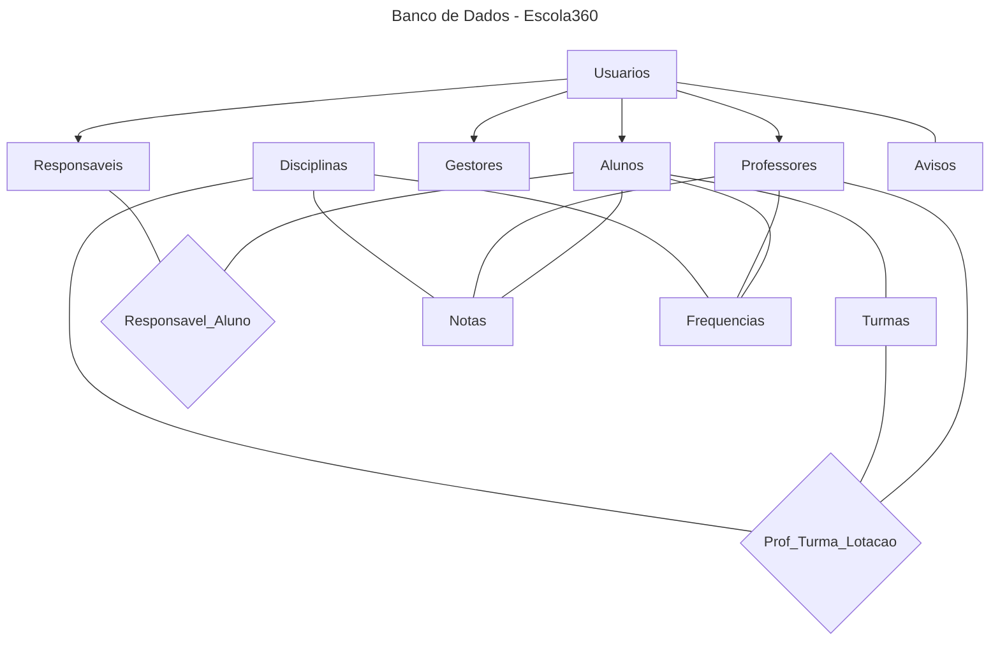

# Escola360 — Dashboard de Acompanhamento Escolar

O Escola360 é uma aplicação de gestão escolar que modela o ecossistema de uma instituição de ensino. Desenvolvido com foco em boas práticas de programação, extensibilidade e manutenibilidade, o sistema oferece uma base sólida para o gerenciamento acadêmico.

> **Aviso:** O sistema está na fase inicial de desenvolvimento. Nesta etapa foi implementado apenas o núcleo do backend.

---

## Características Principais

- Gestão de múltiplos tipos de usuários (professores, alunos, responsáveis, gestores)
- Controle completo de notas e frequência
- Sistema de disciplinas curriculares
- Geração de relatórios
- Arquitetura modular e extensível

---

## Visão Geral do Projeto

O projeto está organizado em módulos, cada um representando uma parte do domínio:

| Arquivo          | Descrição                                                                                   |
|------------------|---------------------------------------------------------------------------------------------|
| `usuarios.py`    | Classes base (`Usuario`, `Autenticavel`, `GeradorRelatorio`) e papéis de gestão, ensino e acompanhamento (`Professor`, `Gestor`, `Responsavel`). |
| `aluno.py`       | Implementação da classe `Aluno` e seus métodos de consulta de dados acadêmicos.             |
| `disciplinas.py` | Implementação da classe `Disciplina` e seu registro de notas e frequências.                 |
| `avaliacao.py`   | Classes que representam registros acadêmicos (`Nota` e `Frequencia`).                       |
| `relatorios.py`  | Classe simples para o objeto `Relatorio`, usado pelo `Gestor`.                              |
| `main.py`        | Script de demonstração para testar as funcionalidades e relações entre as classes.          |

---

## Como Executar

Certifique-se de ter o **Python 3.10+** instalado e que todos os arquivos estejam na mesma pasta. No terminal, navegue até a pasta do projeto e execute:

```bash
python main.py
```

Você deverá ver uma saída semelhante a:

```
--- 1. CRIAÇÃO DE ENTIDADES ---
Professor criado: João Silva (ID: 10)
----------------------------------------
--- 2. TESTES DE AUTENTICAÇÃO ---
Login de João Silva: SUCESSO.
Login de João Silva: FALHA (esperado).
----------------------------------------
--- 3. LANÇAMENTO DE NOTAS E VALIDAÇÃO ---
Nota 9.0 em Matemática lançada com sucesso.
Nota 7.5 em Português lançada com sucesso.
Teste de Erro de Nota: SUCESSO. Erro capturado: valor da nota deve estar entre 0 e 10
----------------------------------------
--- 4. TESTES DE FREQUÊNCIA E CÁLCULOS ---
Total de Aulas de Matemática: 5
Presenças: 3 | Faltas: 2
Porcentagem de Frequência: 60.00%
----------------------------------------
--- 5. TESTES DE RELACIONAMENTO ---
Notas registradas para Ana Pereira:
  > Matemática: 9.0 (Prova Mensal)
  > Português: 7.5 (Trabalho)
Notas registradas em Matemática:
  > Aluno: Ana Pereira, Nota: 9.0
```

> Os textos exatos podem variar conforme adaptações no arquivo `main.py`.

---

## Conceitos de Design e Boas Práticas

Este projeto foi desenvolvido como um modelo de domínio didático, aplicando boas práticas de Programação Orientada a Objetos (POO):

**Herança e polimorfismo**
`Usuario` é a classe base abstrata, enquanto `Gestor`, `Professor`, `Responsavel` e `Aluno` especializam seu comportamento. Interfaces como `Autenticavel` e `GeradorRelatorio` definem contratos claros.

**Encapsulamento**
Atributos privados (`__nome`, `__notas`, `__frequencias` etc.) são expostos via properties, retornando apenas o necessário. As coleções são retornadas como cópias para evitar modificação externa direta.

**Validação de regras de negócio**
Notas limitadas entre 0 e 10, status de frequência restrito a `"P"` ou `"F"`, e-mail com formato mínimo, ID positivo e CPF não vazio.

**Consistência do modelo**
Ao lançar uma nota ou registrar uma frequência, o código atualiza simultaneamente as listas do `Professor`, do `Aluno` e da `Disciplina`, garantindo que todos os lados do relacionamento se mantenham sincronizados.

---

## Possíveis Usos do Escola360

Embora seja um projeto de fins didáticos, o Escola360 já representa um núcleo que pode ser expandido em várias direções:

**1. Backend de um sistema escolar web ou mobile:**
Servir como camada de domínio em uma API (Flask, FastAPI ou Django), expondo endpoints para cadastro de usuários e disciplinas, lançamento de notas, registro de frequência e geração de relatórios.

**2. Ferramenta de acompanhamento pedagógico:**
Permitir que professores e gestores registrem avaliações e presenças em tempo real, gerem relatórios por aluno, turma ou disciplina, e exportem dados em CSV/JSON.

**3. Portal de pais e alunos:**
Alimentar um portal onde responsáveis e alunos acessam informações em tempo real — notificações de ocorrências, agendamento de reuniões e acompanhamento de atividades escolares.

**4. Integração com ERPs escolares:**
Atuar como módulo de "vida acadêmica" (notas, frequências, boletins) e fonte de dados para dashboards de desempenho e evasão escolar.

---

## Banco de Dados

O projeto físico do banco de dados foi desenvolvido com **PostgreSQL**, escolhido por seu suporte robusto, integridade referencial, constraints avançadas e conformidade com os padrões SQL.

**Dominar essa etapa é fundamental, principalmente para quem está aprendento a programar**. Um projeto físico bem feito é essencial para qualquer aplicação séria. Entender a lógica por trás da criação das tabelas, dos relacionamentos, das chaves, ajuda o estudante a desenvolver sistemas mais robustos, organizados e profissionais. Além disso, quando o banco de dados é mal implementado o código do programa (front-end e back-end) fica mais complexo, lento e cheio de "gambiarras" para compensar as falhas na estrutura de dados.
O diagrama abaixo é uma representação simplificada no banco de dados criado para o Escola360. O código SQL e o diagrama lógico estão nos arquivos do projeto.



---

## Prototipação da Interface (Wireframe)

Antes do desenvolvimento completo do frontend de qualquer projeto, é uma prática recomendada realizar a prototipação da interface utilizando wireframes. Um wireframe é uma representação visual simplificada da interface de um sistema, utilizada para planejar a organização dos elementos da tela, a navegação entre páginas e a experiência do usuário (UX), sem focar inicialmente em cores, tipografia ou design visual final. No projeto **Escola360**, o processo de criação do wireframe seguiu uma abordagem baseada em **Design Centrado no Usuário (DCU)**, priorizando as necessidades reais dos diferentes perfis que utilizam a plataforma.

### Perfis de Usuário

| Perfil        | Necessidade principal                                                                 |
|---------------|--------------------------------------------------------------------------------------|
| Gestor        | Visão macroscópica da instituição, com acesso a indicadores gerais e ferramentas administrativas. |
| Professor     | Operações acadêmicas rápidas: lançamento de notas, calendário, avisos e registro de frequência.          |
| Aluno         | Consulta de informações acadêmicas: boletim, calendário e avisos.                    |
| Responsável   | Acompanhamento do desempenho do aluno: boletim, frequência e comunicados da escola.  |

#### A identificação desses perfis é essencial para orientar as decisões de design da interface.

### Funcionalidades Principais

- Login e autenticação de usuários
- Gerenciamento de turmas, disciplinas e usuários
- Dashboard com indicadores acadêmicos
- Lançamento de notas e registro de frequência
- Consulta de boletim escolar
- Comunicação escolar (avisos)
- Geração de relatórios

### Estrutura de Navegação (Sitemap)

#### Antes de iniciar o desenho das telas, é importante definir **como o usuário navegará pelo sistema**. Essa estrutura é representada por um **Sitemap**, que demonstra a hierarquia de páginas e a relação entre elas. Essa etapa é essencial para garantir:

- organização da informação
- clareza de navegação
- escalabilidade do sistema

```
Login
 ├── Dashboard Gestor
 │    ├── Gerenciar Usuários
 │    ├── Gerenciar Turmas
 │    ├── Gerenciar Disciplinas
 │    └── Relatórios
 │
 ├── Dashboard Professor
 │    ├── Minhas Turmas
 │    ├── Lançar Notas
 │    ├── Lançar Frequência
 │    └── Comunicação Escolar
 │
 ├── Dashboard Aluno
 │    ├── Boletim Escolar
 │    ├── Calendário de Aulas
 │    └── Mural de Avisos
 │
 └── Dashboard Responsável
      ├── Boletim e Frequência
      ├── Calendário de Aulas
      └── Mural de Avisos
```

## Estruturação de Interface

Nesta etapa, o foco está na **organização dos elementos na tela**, sem preocupação inicial com cores, tipografia ou design visual final. 
O wireframe utiliza **caixas, linhas e blocos estruturais** para representar os componentes da interface.

Em geral, um wireframe deve apresentar:

- Estrutura geral da página
- Menus de navegação
- Botões principais
- Campos de formulário
- Listas e tabelas
- Indicadores e dashboards

#### O wireframe do Escola360 adotou as seguintes diretrizes estruturais:

- Dashboards com indicadores rápidos
- Menu lateral fixo para navegação entre módulos
- Tabelas estruturadas para lançamento de notas e registro de presença
- Mural de avisos para comunicação entre escola, alunos e responsáveis

Essas decisões ajudam a tornar o sistema **mais organizado, intuitivo e eficiente para os usuários**.

### Ferramentas Recomendadas para Wireframe

Figma, Adobe XD, Balsamiq, Draw.io, Canva, Miro.

### Validação do Wireframe

Após a criação, o wireframe deve ser validado com usuários ou stakeholders, avaliando se a navegação é intuitiva, se os rótulos dos menus são compreensíveis e se as funcionalidades estão organizadas de forma clara. Identificar problemas ainda nessa fase reduz custos e retrabalho no desenvolvimento.

### Design Centrado no Usuário (DCU)

O DCU é uma metodologia que coloca o usuário final no centro das decisões de design, considerando suas necessidades, limitações e comportamentos reais. No Escola360, esses princípios contribuíram para a redução de erros humanos, melhoria da usabilidade, redução da carga cognitiva e maior eficiência operacional com o objetivo de entregar não apenas código funcional, mas um sistema capaz de resolver problemas reais do ambiente educacional, proporcionando uma experiência digital mais eficiente e acessível.

Os protótipos podem ser acessados nos links abaixo:

- [Wireframe no Canva](https://www.canva.com/design/DAHDIPYx7nA/XpXM37A0sk16S8uJbUUmSQ/view?utm_content=DAHDIPYx7nA&utm_campaign=designshare&utm_medium=link2&utm_source=uniquelinks&utlId=h2e84121a01)
- [Sitemap no Canva](https://www.canva.com/design/DAHDY5SmND8/7ZSYfonM0voc1M9omXmlog/view?utm_content=DAHDY5SmND8&utm_campaign=designshare&utm_medium=link2&utm_source=uniquelinks&utlId=h5c3b7229cb)

## Importância da Experiência do Usuário (UX)

A Experiência do Usuário é o conjunto de percepções, emoções e reações que uma pessoa tem ao interagir com um produto digital. Devemos sempre nos perguntar "como uma pessoa se sente ao usar esse sistema?".

Um sistema pode ter todas as informações que o usuário precisa e ainda assim falhar completamente. Isso acontece quando a interface é confusa, os botões estão no lugar errado, as cores dificultam a leitura ou o fluxo de navegação exige que o usuário adivinhe o próximo passo. E isso leva a desistência do usuário para usá-lo.

Um bom design de interface mostra que a pessoa está no controle, quando o usuário abre o aplicativo e imediatamente entende onde está, o que pode fazer e como chegar onde quer.

No contexto do Escola360, esse risco é especialmente crítico. O nosso usuário principal, que é o pai ou responsável, muitas vezes não tem familiaridade com tecnologia, acessa o aplicativo pelo celular em momentos rápidos do dia e precisa encontrar a informação que busca em segundos. Se a interface não for intuitiva, ele simplesmente para de usar e o problema que a plataforma veio resolver continua existindo.
 
No desenvolvimento do nosso projeto, a preocupação com o UX guiou decisões práticas desde o início: a escolha das cores com base na psicologia visual, a organização das informações mais importantes na tela inicial, a simplicidade dos ícones e a clareza das notificações. Cada uma dessas decisões tem um impacto direto em se um pai em Itapipoca vai abrir o aplicativo amanhã de manhã ou não.
 
E ainda mais importante, o UX tem que ser pensado no quesito de inclusão. Um design bem planejado torna a tecnologia acessível para quem mais precisa dela e é esse compromisso que orienta o desenvolvimento do Escola360.

### Protótipo de Alta Fidelidade (Figma)
 
Após a etapa de wireframe, o projeto Escola360 evoluiu para um protótipo de alta fidelidade, desenvolvido no Figma. Diferente do wireframe, que tem foco estrutural, o protótipo de alta fidelidade representa a interface de forma mais próxima ao produto final, incluindo identidade visual, paleta de cores, tipografia, componentes interativos, organização visual dos elementos, experiência de navegação, responsividade e usabilidade.
 
- [Protótipo no Figma](https://www.figma.com/site/Emqrc76z13FP6LB8lXMvCq/Escola360?node-id=0-1&t=YLUsID5bcvFmgdKQ-1)
---
 
## Arquitetura de Software
 
A arquitetura de software pode ser compreendida como a espinha dorsal que estrutura um sistema. Ela define não apenas seus componentes, mas também as relações entre eles e os princípios que governam sua evolução. Assim como um edifício precisa de um projeto estrutural, um sistema de software necessita de um planejamento arquitetônico para garantir seu funcionamento adequado e eficiente.
 
### Por que a Arquitetura é Importante?
 
A arquitetura permite a **modularização do sistema**, dividindo-o em partes colaborativas — o que possibilita o desenvolvimento paralelo entre equipes e reduz a sobrecarga cognitiva dos desenvolvedores. Ela também atua como um **artefato de comunicação** entre arquitetos, desenvolvedores, gerentes e clientes, alinhando expectativas e orientando decisões técnicas e de negócio.
 
Além disso, as decisões arquiteturais determinam, ainda antes da implementação, as tecnologias que poderão ser utilizadas, como ocorrerá o fluxo de dados entre os componentes e quais trade-offs serão aceitos — como o equilíbrio entre desempenho, escalabilidade e complexidade.
 
### Influência nos Atributos de Qualidade
 
Um dos aspectos mais relevantes da arquitetura é sua influência direta sobre os atributos de qualidade, que definem **como** o sistema se comporta:
 
| Atributo          | Impacto da Arquitetura                                                                                     |
|-------------------|------------------------------------------------------------------------------------------------------------|
| Escalabilidade    | A forma como o sistema é particionado determina sua capacidade de crescimento.                             |
| Segurança         | O isolamento de dados sensíveis e a definição de fronteiras de confiança reduzem a superfície de ataque.   |
| Desempenho        | O arranjo dos componentes e os fluxos de comunicação impactam diretamente a velocidade do sistema.         |
| Manutenibilidade  | Em um sistema bem projetado, alterações em uma regra de negócio não exigem modificações extensas em outros módulos. |
| Evolução          | Uma boa arquitetura protege as regras de negócio das mudanças tecnológicas, evitando reescritas completas. |
 
### Concluindo, a qualidade de um projeto de software está diretamente relacionada à qualidade de sua arquitetura. É ela que determina se o software terá uma vida útil longa e sustentável ou então, se tornará um sistema legado de difícil manutenção. 
---

## Desenvolvedores

| Nome                              | E-mail                               |
|-----------------------------------|--------------------------------------|
| Aldemir Ferreira da Silva Junior  | junior.ferreira@aluno.ufca.edu.br    |
| Beatriz Benigno de Vasconcelos    | benigno.beatriz@aluno.ufca.edu.br    |
| Francisco Diogo de Sousa Silva    | sousa.diogo@aluno.ufca.edu.br        |
| Francisco Sávio Sousa da Cunha    | savio.cunha@aluno.ufca.edu.br        |
| João Paulo Lima David             | lima.david@aluno.ufca.edu.br         |

---

## Requisitos

- Python 3.10+
- Nenhuma dependência externa

---

## Licença

Uso livre para fins acadêmicos e didáticos.
